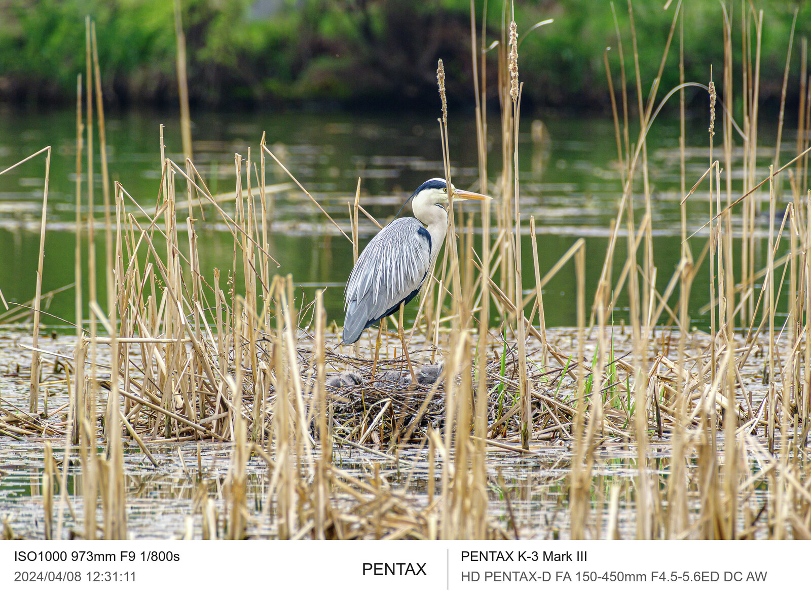
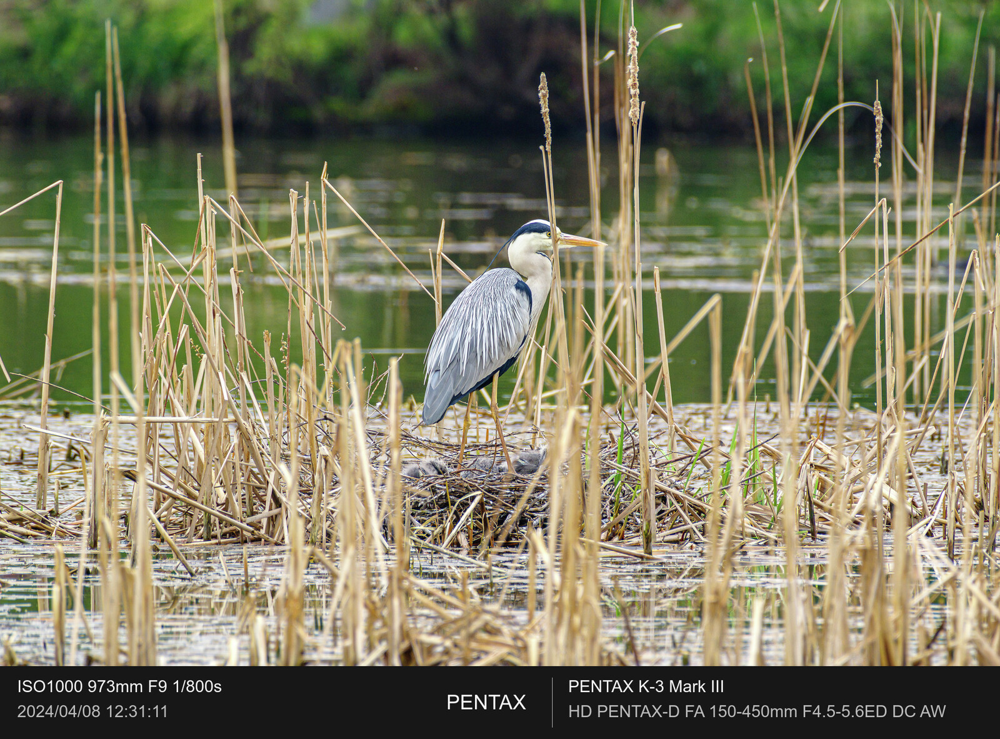
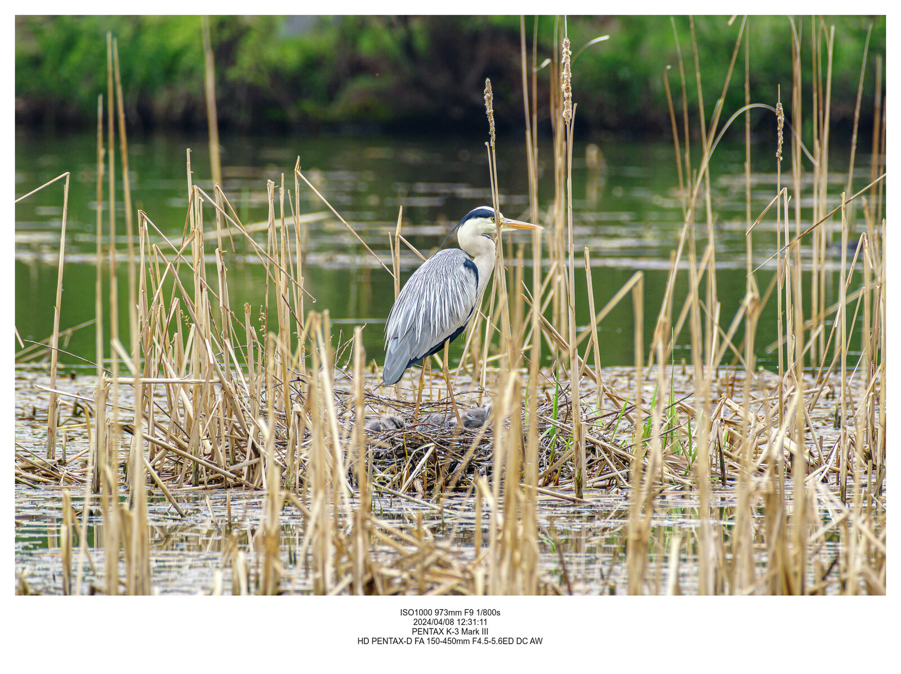

<div align="center">
  <h1>Lightroom EXIF Frame</h1>
  <p>사진 바깥에 촬영 정보와 직접 등록한 카메라 로고를 더하는 Lightroom Classic 플러그인<br />A Lightroom Classic export plug-in for EXIF frames and your registered camera logos.</p>
  <p><a href="https://github.com/yunhyok/lightroom-exif-frame/releases">Windows 다운로드 · Download</a> · <a href="https://github.com/yunhyok/lightroom-exif-frame/blob/main/docs/USER_GUIDE.md">사용 가이드 · Guide</a> · <a href="https://github.com/yunhyok/lightroom-exif-frame/blob/main/docs/VALIDATION.md">검증 기록 · Validation</a></p>
</div>

<table>
  <tr><td align="center"><br /><b>Strap · Light</b></td><td align="center"><br /><b>Strap · Dark</b></td></tr>
  <tr><td colspan="2" align="center"><br /><b>Simple</b></td></tr>
</table>

예시는 사용자가 제공한 왜가리 사진입니다. 공개 예시는 긴 변을 최대 1600 px로 줄이고 내부 메타데이터를 제거했습니다. 원본 사진과 공식 카메라 로고는 배포하지 않습니다. 예시 사진의 권리는 [별도 표시](docs/images/LICENSE.md)를 따릅니다.<br />
Examples use the user's supplied heron photograph, reduced to a maximum 1600 px long edge with embedded metadata removed. The original photo and official camera logos are not bundled. Example photographs retain their [separate reserved rights](docs/images/LICENSE.md).

## 설치 · Install

Windows x64용 **v0.1.0**입니다. Lightroom **Classic**의 내보내기 플러그인이며, 클라우드 기반 Lightroom에서는 사용할 수 없습니다. SDK API 기준은 13입니다. 실제 확인한 버전과 남은 검증은 [검증 기록](https://github.com/yunhyok/lightroom-exif-frame/blob/main/docs/VALIDATION.md)을 참고하세요.

This is **v0.1.0 for Windows x64**, an export plug-in for Lightroom **Classic**. The SDK API baseline is 13. Consult the [validation record](https://github.com/yunhyok/lightroom-exif-frame/blob/main/docs/VALIDATION.md) for tested versions and outstanding checks.

1. [Releases](https://github.com/yunhyok/lightroom-exif-frame/releases)에서 `Lightroom-EXIF-Frame-0.1.0-Windows-x64.zip`을 내려받아 보관할 폴더에 압축을 풉니다.<br />Download the Windows ZIP and extract it to a permanent folder.
2. `LightroomExifFrame.lrplugin` 폴더 전체를 유지합니다. `bin` 폴더에는 실행 도구와 필요한 라이브러리가 있습니다.<br />Keep the entire `.lrplugin` folder, including `bin` and its supporting files.
3. Lightroom Classic → **파일 → 플러그인 관리자 → 추가**에서 이 `.lrplugin` 폴더를 선택합니다.<br />In Lightroom Classic, choose **File → Plug-in Manager → Add** and select the `.lrplugin` folder.
4. 사진을 선택하고 **파일 → 내보내기**, 내보내기 대상에서 **EXIF Frame**을 선택합니다.<br />Select photos, open **File → Export**, and select **EXIF Frame** as the export destination.

배포 ZIP에는 필요한 실행 도구가 포함됩니다. Python, ImageMagick, ExifTool을 별도로 설치할 필요가 없습니다.<br />
The release ZIP includes its runtime tools; a separate Python, ImageMagick, or ExifTool installation is unnecessary.

## 사용 · Use

1. 플러그인의 출력 폴더와 JPG/PNG/WebP 형식을 선택합니다. JPG/PNG는 색공간, PNG는 8/16비트를 선택할 수 있습니다.<br />Choose the output folder and JPG, PNG, or WebP. Select a color space for JPG/PNG and a bit depth for PNG.
2. Lightroom의 기본 **파일 이름 지정, 이미지 크기 조정, 출력 선명하게 하기, 메타데이터** 설정을 조정합니다. 크기 조정은 **사진 본체**에 적용되고 프레임은 그 바깥에 추가됩니다.<br />Use Lightroom's native naming, image sizing, output sharpening, and metadata controls. Sizing applies to the **photo body**; the frame increases the final canvas.
3. **Strap / Simple / None**과 밝게/어둡게/사용자 색상을 선택합니다. 네 텍스트 영역에 원하는 토큰을 넣습니다.<br />Choose **Strap, Simple, or None**, a light/dark/custom appearance, and four text templates.
4. 필요한 제조사의 공식 투명 PNG 로고를 직접 등록합니다. 등록 경로는 사용자별 Lightroom 플러그인 설정에 저장됩니다.<br />Register your own official transparent PNG logos by manufacturer. Their paths are saved in your per-user plug-in preferences.
5. **미리보기**로 선택한 사진을 확인한 뒤 내보냅니다. 미리보기는 현재 Lightroom 설정으로 새로 렌더링하므로 시간이 걸릴 수 있습니다.<br />Preview the selected photo, then export. Preview renders it again through Lightroom using the current settings and may take time.

동일한 이름의 파일이 있으면 번호를 붙여 저장합니다. 배치 작업을 취소하면 실행 중인 사진 한 장의 처리를 마친 뒤 다음 사진부터 중단합니다.<br />
Existing files are preserved by allocating a numbered filename. Batch cancellation finishes the photo currently being processed, then stops before the next one.

<details>
<summary><b>형식과 메타데이터 · Formats and metadata</b></summary>

| 출력 · Output | 비트 · Depth | 색공간 · Color space | 압축 · Compression |
|---|---|---|---|
| JPG | 8-bit | sRGB / Adobe RGB / ProPhoto RGB | Quality 1–100 |
| PNG | 8 / 16-bit | sRGB / Adobe RGB / ProPhoto RGB | Lossless |
| WebP | 8-bit | sRGB | Quality 1–100 / lossless |

Lightroom에서 선택한 색공간의 **16비트 TIFF와 ICC 프로파일**을 임시 렌더링한 다음 프레임을 합성합니다. WebP는 sRGB로 렌더링합니다. 미리보기는 화면 표시용 sRGB PNG입니다.

Lightroom produces a temporary **16-bit TIFF with the selected ICC profile** before framing. WebP uses sRGB. Preview is an sRGB PNG for display.

최종 파일 내부 메타데이터의 복사 원본은 **Lightroom이 렌더링한 TIFF만** 사용합니다. Lightroom의 메타데이터 제외 및 GPS 제거 설정을 우회해 원본 파일의 태그를 복구하지 않습니다. 프레임에 보이는 텍스트는 별도의 카탈로그 촬영 정보이며, 내부 메타데이터 제외와 독립적입니다.

Embedded metadata is copied **only from Lightroom's rendered TIFF**. The plug-in does not restore original-file tags removed by Lightroom's metadata or GPS settings. Visible frame text uses separate catalog information and is independent of embedded metadata removal.

컨테이너 차이 때문에 모든 태그를 바이트 단위로 동일하게 보존하는 것은 지원하지 않습니다. WebP의 IPTC IIM은 지원되는 XMP 항목으로 변환합니다. 회전·크기는 최종 이미지에 맞추고, 오래된 미리보기와 일부 제조사 전용 정보는 제외합니다. 지원되지 않는 위치 기반 태그는 경고와 함께 생략합니다. 자세한 범위는 [가이드](https://github.com/yunhyok/lightroom-exif-frame/blob/main/docs/USER_GUIDE.md#metadata)를 참고하세요.

Container differences prevent byte-for-byte preservation of every tag. WebP maps supported IPTC IIM fields to XMP. Orientation and dimensions are updated; stale previews and some manufacturer-specific data are excluded. Unsupported spatial tags are omitted with warnings. See the [guide](https://github.com/yunhyok/lightroom-exif-frame/blob/main/docs/USER_GUIDE.md#metadata).

</details>

<details>
<summary><b>토큰과 레이아웃 · Tokens and layout</b></summary>

기본 Strap 구성은 왼쪽 촬영 정보/시간, 가운데 로고, 오른쪽 카메라/렌즈입니다. Simple은 사진 주변 여백과 가운데 정렬한 하단 정보를 사용합니다. None은 프레임 없이 선택한 형식으로 내보냅니다.

Strap places exposure/time on the left, a registered logo in the middle, and camera/lens on the right. Simple adds surrounding padding and centered footer text. None exports without a frame.

| 토큰 · Token | 내용 · Value |
|---|---|
| `{iso}` / `{aperture}` / `{shutter}` | ISO / 조리개 값 · f-number / 노출 시간 · exposure time |
| `{focal}` / `{focal35}` | 선택한 초점거리 방식 · selected focal mode / 35 mm equivalent |
| `{date}` | Lightroom 촬영 일시 · Lightroom capture date/time |
| `{make}` / `{model}` / `{lens}` | 제조사 / 모델 / 렌즈 · make / model / lens |
| `{artist}` | 입력한 이름, 비워 두면 카탈로그 아티스트 · entered name, otherwise catalog artist |

예: `ISO{iso} {focal}mm F{aperture} {shutter}s`. 값이 없는 토큰은 `—`로 표시합니다. 글이 길면 줄바꿈하거나 줄이며, 공간에 들어가지 않으면 경고와 함께 생략합니다.

Example: `ISO{iso} {focal}mm F{aperture} {shutter}s`. Missing values display `—`. Long text wraps or shrinks; text that cannot fit is omitted with a warning.

</details>

<details>
<summary><b>개발 및 빌드 · Development and build</b></summary>

Windows x64에서 Python 3.12를 사용합니다. 고정 버전 의존성과 공급 도구의 출처는 [THIRD_PARTY_NOTICES.md](THIRD_PARTY_NOTICES.md)에 기록합니다. 빌드 스크립트는 필요한 공급 도구를 다운로드하고 지정된 SHA-256을 확인합니다.

Build on Windows x64 with Python 3.12. Pinned dependencies and vendor provenance are documented in [THIRD_PARTY_NOTICES.md](THIRD_PARTY_NOTICES.md). The build fetches vendor tools and checks their pinned SHA-256 hashes.

```powershell
python -m venv .venv
.\.venv\Scripts\python.exe -m pip install -r requirements-dev.txt
.\.venv\Scripts\python.exe scripts\fetch_vendor.py
.\.venv\Scripts\python.exe -m unittest discover -s tests -v
.\.venv\Scripts\python.exe scripts\build.py
```

검사 전에 공급 도구를 가져와야 실제 렌더링·메타데이터 검사가 실행됩니다. 결과는 플러그인과 문서를 포함한 ZIP 및 `dist/SHA256SUMS.txt`입니다.<br />
Fetch vendor tools before testing so rendering and metadata tests run. Outputs are the ZIP containing the plug-in and documentation, plus `dist/SHA256SUMS.txt`.

Lua 플러그인이 Lightroom 내보내기를 제어하고, 번들 실행 파일이 ImageMagick Q16과 ExifTool로 합성·변환·메타데이터 처리를 수행합니다. 개발자용 요청/응답 계약은 [docs/protocol.md](docs/protocol.md)에 있습니다. Python/Lua 모의 SDK 검사와 실제 Lightroom 검사는 [검증 기록](https://github.com/yunhyok/lightroom-exif-frame/blob/main/docs/VALIDATION.md)에서 구분합니다.

Lua controls the Lightroom export; the bundled helper uses ImageMagick Q16 and ExifTool for rendering, conversion, and metadata. The helper contract is in [docs/protocol.md](docs/protocol.md). Automated tests and live Lightroom checks are distinguished in the [validation record](https://github.com/yunhyok/lightroom-exif-frame/blob/main/docs/VALIDATION.md).

</details>

## 라이선스와 참고 · License and references

원본 플러그인/헬퍼 소스는 [MIT](LICENSE)입니다. 이 라이선스는 사진, 사용자 등록 로고, 글꼴에 대한 권리를 부여하지 않습니다. 해당 자료의 이용 조건을 확인하세요. 제조사 로고와 글꼴은 배포하지 않습니다. Adobe 또는 카메라 제조사가 승인한 제품은 아닙니다.

Original plug-in/helper source is [MIT licensed](LICENSE). This license does not grant rights to photographs, registered logos, or fonts. Check their own usage terms. Logos and fonts are not distributed. This independent project is not endorsed by Adobe or camera manufacturers.

- [Adobe Lightroom Classic SDK](https://developer.adobe.com/lightroom-classic/): 내보내기 플러그인 API · export plug-in APIs.
- [ExifTool WebP/RIFF tags](https://exiftool.org/TagNames/RIFF.html), [PNG tags](https://exiftool.org/TagNames/PNG.html): 형식별 메타데이터 구조 · metadata containers.
- [ExifTool IPTC-to-XMP mapping](https://github.com/exiftool/exiftool/blob/master/arg_files/iptc2xmp.args): 지원되는 IPTC 변환 · supported IPTC conversion.
